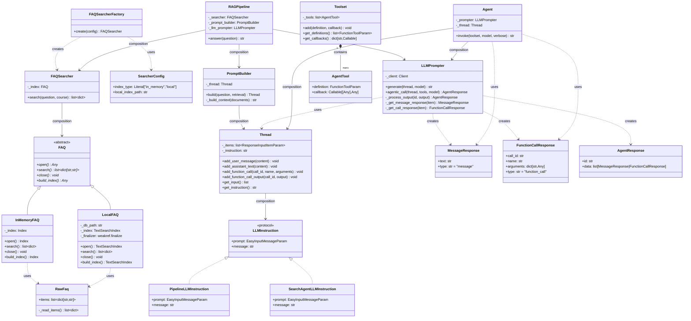
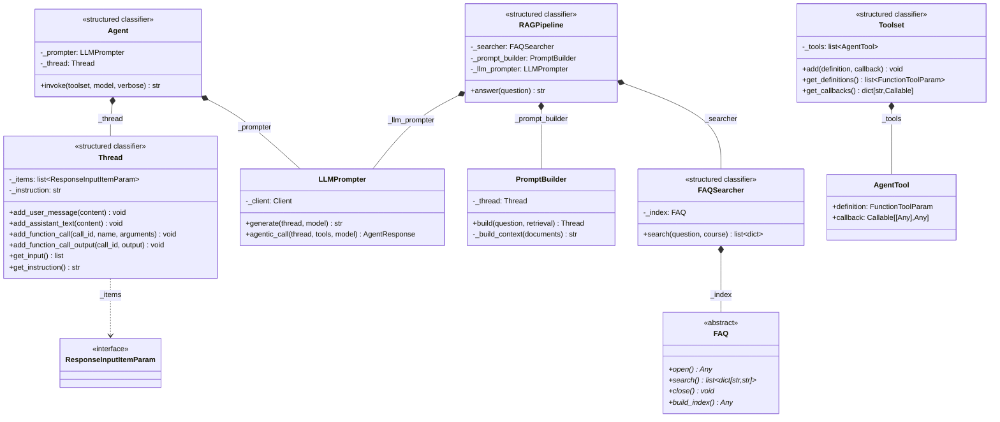

## Diagramas

### Diagrama de Clases

```mermaid
classDiagram
    direction TB

    class FAQ {
        <<abstract>>
        +open()* Any
        +search()* list~dict[str,str]~
        +close()* void
        +build_index()* Any
    }

    class InMemoryFAQ {
        -_index: Index
        +open() Index
        +search() list~dict~
        +close() void
        +build_index() Index
    }

    class LocalFAQ {
        -_db_path: str
        -_index: TextSearchIndex
        -_finalizer: weakref.finalize
        +open() TextSearchIndex
        +search() list~dict~
        +close() void
        +build_index() TextSearchIndex
    }

    class RawFaq {
        +items: list~dict[str,str]~
        -_read_items() list~dict~
    }

    class FAQSearcher {
        -_index: FAQ
        +search(question, course) list~dict~
    }

    class SearcherConfig {
        +index_type: Literal["in_memory","local"]
        +local_index_path: str
    }

    class FAQSearcherFactory {
        +create(config) FAQSearcher
    }

    class LLMInstruction {
        <<protocol>>
        +prompt: EasyInputMessageParam
        +message: str
    }

    class PipelineLLMInstruction {
        +prompt: EasyInputMessageParam
        +message: str
    }

    class SearchAgentLLMInstruction {
        +prompt: EasyInputMessageParam
        +message: str
    }

    class Thread {
        -_items: list~ResponseInputItemParam~
        -_instruction: str
        +add_user_message(content) void
        +add_assistant_text(content) void
        +add_function_call(call_id, name, arguments) void
        +add_function_call_output(call_id, output) void
        +get_input() list
        +get_instruction() str
    }

    class PromptBuilder {
        -_thread: Thread
        +build(question, retrieval) Thread
        -_build_context(documents) str
    }

    class LLMPrompter {
        -_client: Client
        +generate(thread, model) str
        +agentic_call(thread, tools, model) AgentResponse
        -_process_output(id, output) AgentResponse
        -_get_message_response(item) MessageResponse
        -_get_call_response(item) FunctionCallResponse
    }

    class MessageResponse {
        +text: str
        +type: str = "message"
    }

    class FunctionCallResponse {
        +call_id: str
        +name: str
        +arguments: dict[str,Any]
        +type: str = "function_call"
    }

    class AgentResponse {
        +id: str
        +data: list[MessageResponse|FunctionCallResponse]
    }

    class Toolset {
        -_tools: list~AgentTool~
        +add(definition, callback) void
        +get_definitions() list~FunctionToolParam~
        +get_callbacks() dict[str,Callable]
    }

    class AgentTool {
        +definition: FunctionToolParam
        +callback: Callable[[Any],Any]
    }

    class Agent {
        -_prompter: LLMPrompter
        -_thread: Thread
        +invoke(toolset, model, verbose) str
    }

    class RAGPipeline {
        -_searcher: FAQSearcher
        -_prompt_builder: PromptBuilder
        -_llm_prompter: LLMPrompter
        +answer(question) str
    }

    FAQ <|-- InMemoryFAQ
    FAQ <|-- LocalFAQ
    InMemoryFAQ ..> RawFaq : uses
    LocalFAQ ..> RawFaq : uses
    FAQSearcher --> FAQ : composition
    FAQSearcherFactory ..> FAQSearcher : creates
    FAQSearcherFactory ..> SearcherConfig : uses
    LLMInstruction <|.. PipelineLLMInstruction
    LLMInstruction <|.. SearchAgentLLMInstruction
    Thread --> LLMInstruction : composition
    PromptBuilder --> Thread : composition
    RAGPipeline --> FAQSearcher : composition
    RAGPipeline --> PromptBuilder : composition
    RAGPipeline --> LLMPrompter : composition
    LLMPrompter ..> MessageResponse : creates
    LLMPrompter ..> FunctionCallResponse : creates
    LLMPrompter ..> AgentResponse : creates
    LLMPrompter ..> Thread : uses
    Agent --> LLMPrompter : composition
    Agent --> Thread : composition
    Agent ..> MessageResponse : uses
    Agent ..> FunctionCallResponse : uses
    Toolset "1" *-- "many" AgentTool : contains
```

### Diagrama de Estructura de Clases

```mermaid
classDiagram
    direction TB

    class Agent {
        <<structured classifier>>
        -_prompter: LLMPrompter
        -_thread: Thread
        +invoke(toolset, model, verbose) str
    }

    class RAGPipeline {
        <<structured classifier>>
        -_searcher: FAQSearcher
        -_prompt_builder: PromptBuilder
        -_llm_prompter: LLMPrompter
        +answer(question) str
    }

    class FAQSearcher {
        <<structured classifier>>
        -_index: FAQ
        +search(question, course) list~dict~
    }

    class Toolset {
        <<structured classifier>>
        -_tools: list~AgentTool~
        +add(definition, callback) void
        +get_definitions() list~FunctionToolParam~
        +get_callbacks() dict[str,Callable]
    }

    class Thread {
        <<structured classifier>>
        -_items: list~ResponseInputItemParam~
        -_instruction: str
        +add_user_message(content) void
        +add_assistant_text(content) void
        +add_function_call(call_id, name, arguments) void
        +add_function_call_output(call_id, output) void
        +get_input() list
        +get_instruction() str
    }

    class LLMPrompter {
        -_client: Client
        +generate(thread, model) str
        +agentic_call(thread, tools, model) AgentResponse
    }

    class PromptBuilder {
        -_thread: Thread
        +build(question, retrieval) Thread
        -_build_context(documents) str
    }

    class FAQ {
        <<abstract>>
        +open()* Any
        +search()* list~dict[str,str]~
        +close()* void
        +build_index()* Any
    }

    class AgentTool {
        +definition: FunctionToolParam
        +callback: Callable[[Any],Any]
    }

    class ResponseInputItemParam {
        <<interface>>
    }

    Agent *-- LLMPrompter : _prompter
    Agent *-- Thread : _thread
    RAGPipeline *-- FAQSearcher : _searcher
    RAGPipeline *-- PromptBuilder : _prompt_builder
    RAGPipeline *-- LLMPrompter : _llm_prompter
    FAQSearcher *-- FAQ : _index
    Toolset *-- AgentTool : _tools
    Thread ..> ResponseInputItemParam : _items
```

